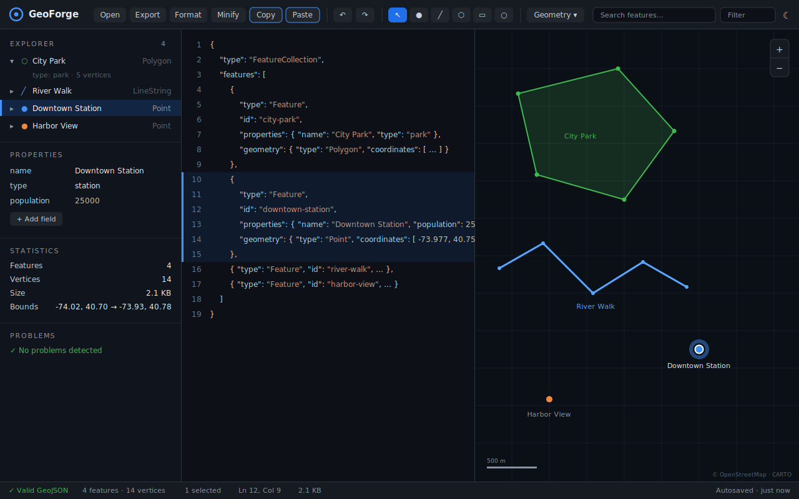

# GeoForge — The Modern GeoJSON Editor

> **The VS Code for GeoJSON.** Professional GeoJSON editing in your browser — fully client-side, no server, no accounts.

GeoForge is a web IDE for GeoJSON files. It doesn't just *display* your data on a map — it gives you a real editing environment: a Monaco code editor, an interactive MapLibre map, and a VS Code-style feature explorer, all kept in sync in real time.

**🌍 Live demo: [mohammadpooshesh.github.io/GeoForge](https://mohammadpooshesh.github.io/GeoForge/)** — no install, no sign-up. Open it in your browser and start editing.



```
+-------------------------------------------------------------+
| Toolbar                                                     |
+--------------------+----------------------+-----------------+
|                    |                      |                 |
| Feature Explorer   | Code Editor          | Map             |
|                    | (Monaco)             | (MapLibre GL)   |
|                    |                      |                 |
+--------------------+----------------------+-----------------+
| Status Bar                                                  |
+-------------------------------------------------------------+
```

## ✨ Features

### Fully bidirectional editing
- Type in the code editor → the map updates instantly.
- Draw or edit on the map → the code updates instantly.
- Select a feature → it highlights on the **map**, in the **tree**, and in the **editor** simultaneously.

### Map (MapLibre GL + Mapbox GL Draw)
- Pan, zoom, draw, edit, delete, select & multi-select
- Draw tools: **Point · LineString · Polygon · Rectangle · Circle** (saved as Polygon with `radius_km`)
- Vertex editing: move / add / delete vertices, drag whole features

### Code editor (Monaco — the VS Code editor)
- JSON syntax highlighting, folding, line numbers
- Search & replace (Ctrl+F / Ctrl+H inside the editor)
- Format (pretty) and Minify
- Live validation as you type
- Click inside a feature's JSON to select it everywhere

### Feature Explorer
- VS Code-style tree of the collection
- Expand a feature to inspect its geometry type and properties
- **Virtualized rendering** — smooth even with 50,000+ features

### Geometry tools (Turf.js, in a Web Worker)
Buffer · Simplify · Union · Difference · Intersect · Centroid · Convex Hull · Envelope · BBox · Explode · Combine · Dissolve · Clean Coords · Truncate · Rotate · Scale · Translate · Area · Length · Bearing · Midpoint

Heavy operations run inside a **Web Worker**, so the UI never freezes.

### Real-time validation
- ✔ Valid JSON / ✖ parse errors
- ✖ Invalid FeatureCollection root
- ✖ Polygon ring not closed
- ✖ Non-numeric coordinates
- ⚠ Empty geometry, duplicate IDs, out-of-range (non-WGS84) coordinates

### Property editor
Add / rename / delete fields, change types (string · number · boolean), sort keys — spreadsheet style.

### Search & filter
- Search across feature IDs, property keys and values
- Filter expressions like `population > 10000` or `type == park` — the map, tree, and stats show only matching features (hidden features are preserved on save)

### And more
- **Statistics**: feature/type/vertex counts, file size, bounds, center, CRS
- **Export**: GeoJSON (pretty / minified) and JSON
- **Clipboard**: **Copy GeoJSON** (the whole document, or just the selection) and **Paste GeoJSON** from the clipboard — accepts a FeatureCollection, a single Feature, a bare geometry, or an array of them
- **History**: full undo/redo (up to 200 steps)
- **Auto-save** to LocalStorage — close the tab, your work survives
- **Dark / light mode**
- **Keyboard shortcuts**: `Ctrl+S` save · `Ctrl+Z` undo · `Ctrl+Y` redo · `Delete` remove · `Ctrl+C/V` copy/paste · `Ctrl+D` duplicate · `Ctrl+A` select all

## 🏗 Architecture

| Layer | Tech |
| --- | --- |
| UI | React 18 + TypeScript |
| Build | Vite |
| Map | MapLibre GL + Mapbox GL Draw (with custom Rectangle & Circle modes) |
| Editor | Monaco Editor |
| Geometry | Turf.js v7 (inside a Web Worker) |
| State | zustand |
| Tests | Vitest |

```
src/
  components/   Toolbar, FeatureTree, CodeEditor, MapView,
                PropertyGrid, GeometryTools, StatsPanel, StatusBar
  hooks/        useGeoWorker, useKeyboardShortcuts
  store/        useStore (zustand — single source of truth)
  utils/        validation, filter, stats, geometry, editorRange, geo
  workers/      geo.worker.ts (Turf ops off the main thread)
  styles/       index.css (dark/light themes via CSS variables)
```

## 🚀 Getting started

```bash
npm install
npm run dev       # start the dev server
npm test          # run the unit test suite (Vitest)
npm run build     # type-check + production build (dist/)
npm run preview   # serve the production build locally
```

Everything is 100% client-side — the production build is a static site you can host anywhere (GitHub Pages, Netlify, Cloudflare Pages…).

## 🗺 Roadmap

- Drag & drop import of KML, GPX and Shapefile (converted to GeoJSON)
- Git-style diff between two GeoJSON versions
- Shareable project links
- Plugin API for custom tools
- Direct export to MapLibre styles / WebGIS projects

## 📄 License

[MIT](./LICENSE)
